# Plots

Below are all generated diagrams for both datasets. Regenerate them with:

```
python ../analyse_mbpp.py
```

## Sanitized

### Stats

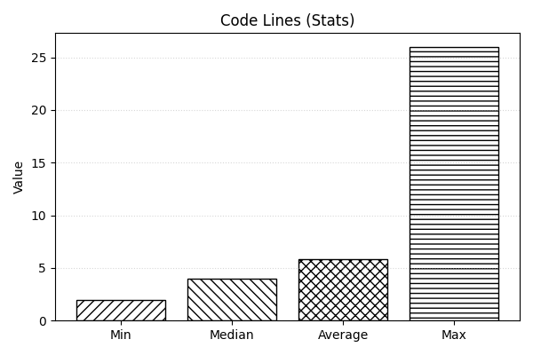

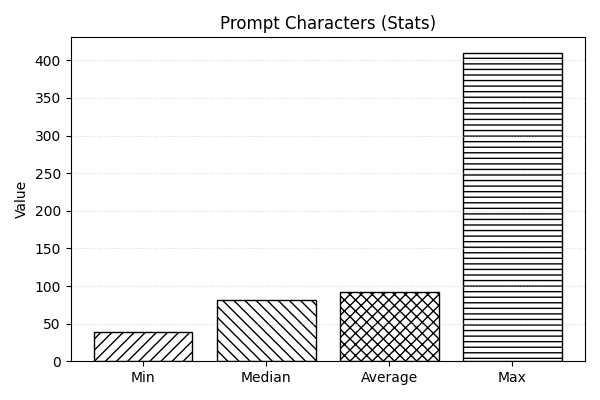

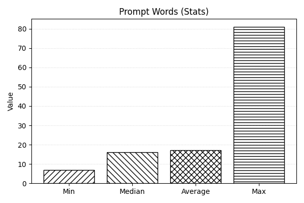

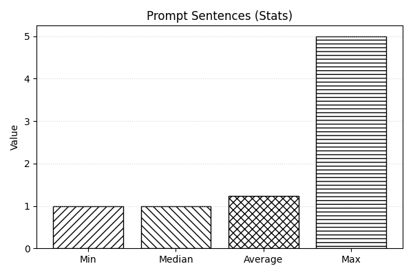

### Histograms

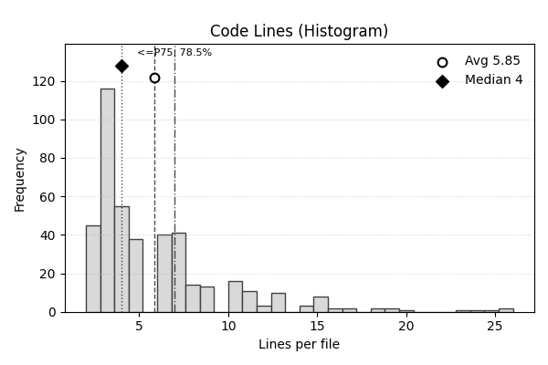

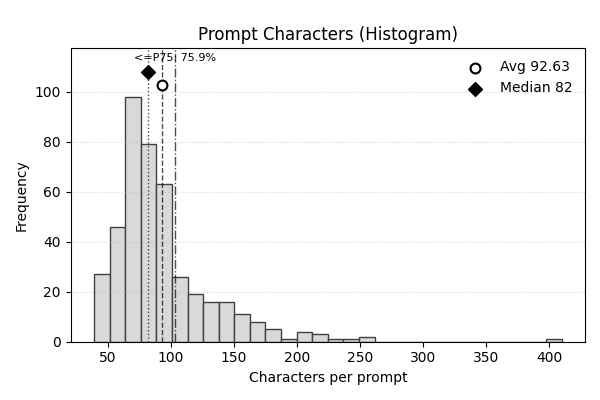

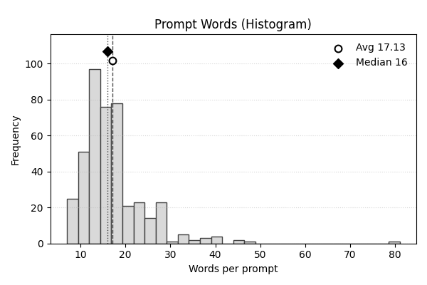

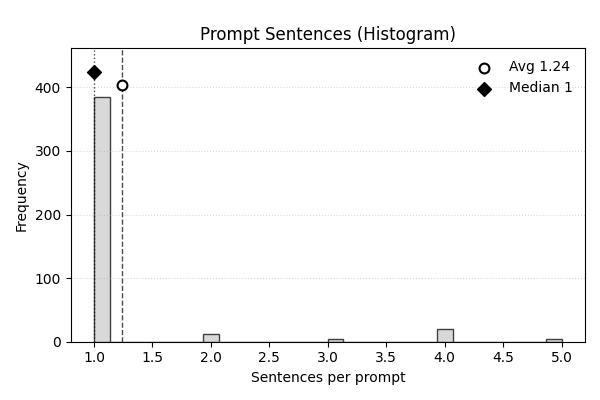

## Original

### Stats

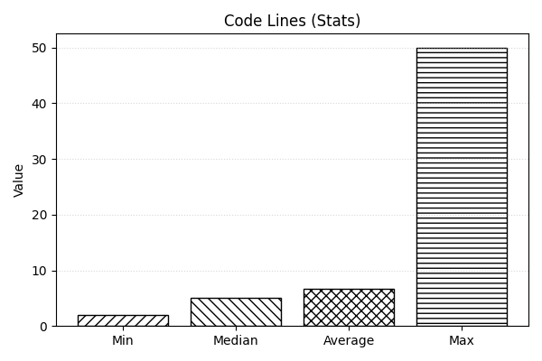

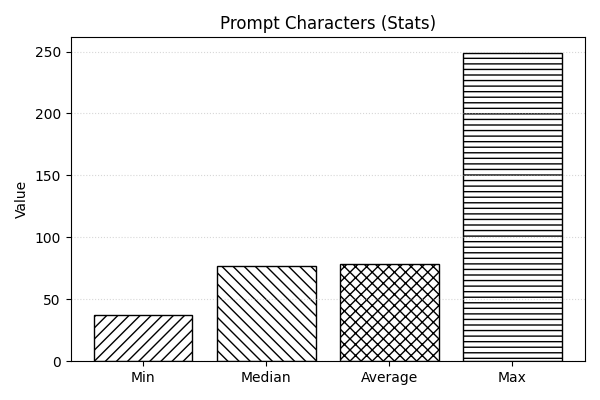


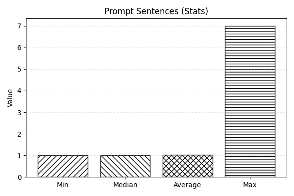

### Histograms

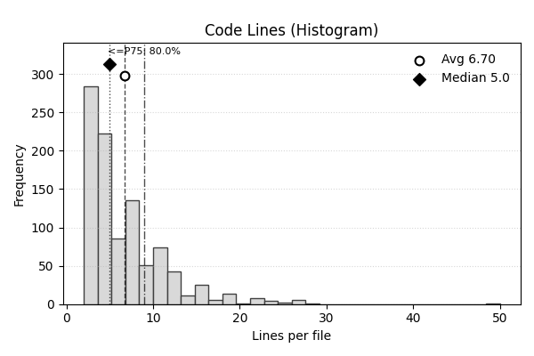

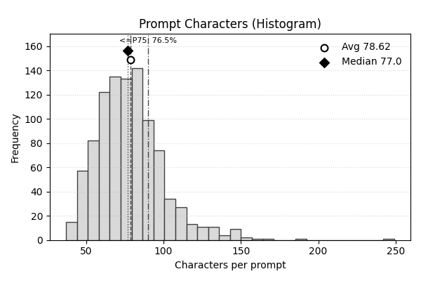

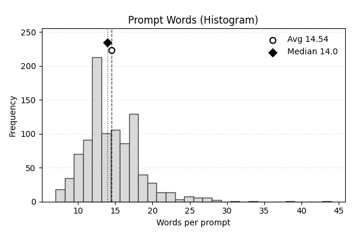

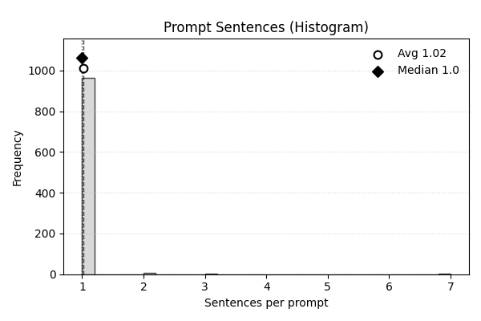
